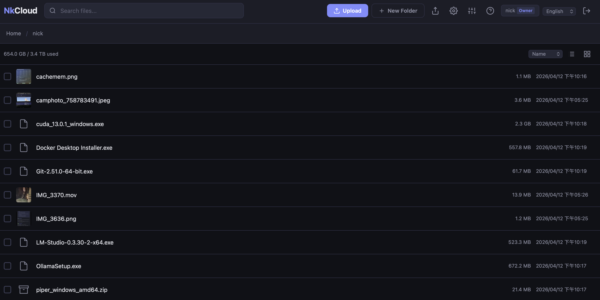
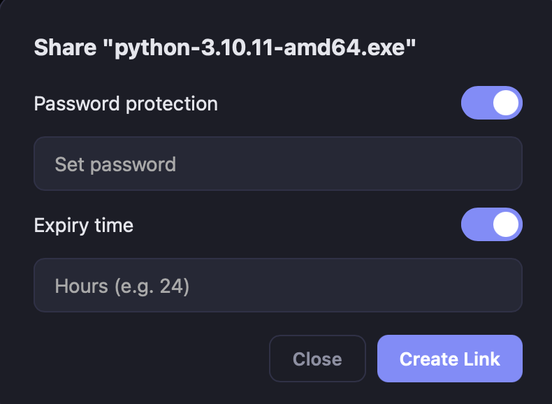
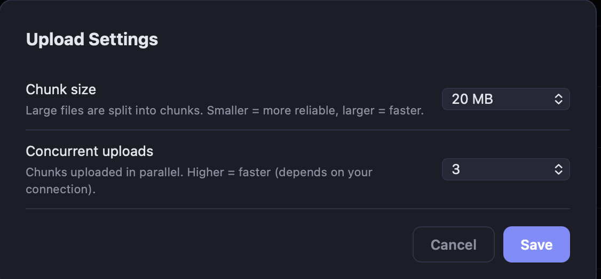
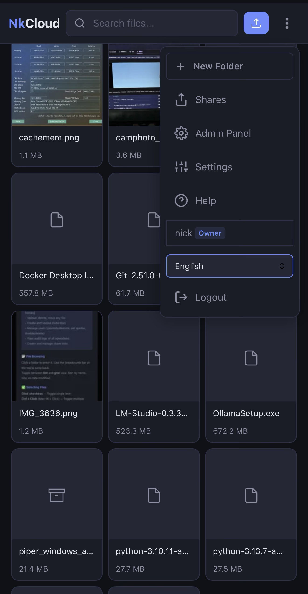
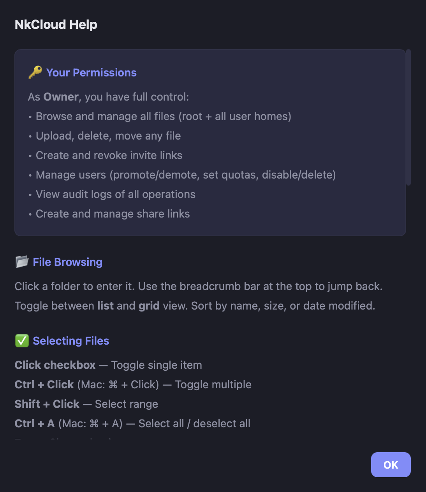

<p align="center">
  <h1 align="center">NkCloud</h1>
  <p align="center"><em>Self-hosted file storage, sitting between Nextcloud and Copyparty.</em></p>
</p>

---

I tried **Nextcloud** — too heavy for what I actually do.
I tried **Copyparty** — powerful, but the UI hurt my eyes.
So I built what I wanted sitting in between.

Single Docker container, modern dark UI, multi-user with share links, WebDAV. That's it.

I'm using it every day to host my own files. Maybe you'll like it too.

> 我試過 Nextcloud，太重；試過 Copyparty，功能夠但 UI 看不下去。就自己做一個在中間的。一個 Docker 容器、暗色 UI、多用戶、分享連結、WebDAV。我自己天天在用，放上來看看有沒有人也喜歡。

---

## Status

**v0.1.0 — this is a personal project I'm sharing, not a polished product.**

- ✅ Runs every day on my homelab (Linux host, served to macOS + iPhone Safari + iPadOS)
- ✅ Tested: Chrome, Safari, Firefox on desktop + mobile
- ⚠️ Windows client: untested (WebDAV mount should work but I haven't verified)
- ⚠️ No automated test suite yet — relying on "I use it myself" for now
- ⚠️ Expect rough edges. Open an issue or PR and I'll take a look

If you need rock-solid multi-tenant collaboration, use Nextcloud. If you need every protocol under the sun, use Copyparty. If you want something small and nice-looking to self-host your own files, give this a try.

## Screenshots


*Desktop file browser — list view, dark theme, thumbnails for images and video*

<p align="center">
  
  
</p>

<p align="center">
  
  &nbsp;&nbsp;
  
</p>

## Quick Start

```bash
git clone https://github.com/nklab-io/nkcloud.git
cd nkcloud
docker compose up -d
```

Open **http://localhost:8000** and follow the setup wizard to create your admin account.

No database to install, no config file to fill in. Your files live under `./storage/` on the host — they're just files, you can read them without NkCloud running.

## Features

**Files**
- Upload, download, move, rename, delete — drag & drop with configurable chunk size and concurrent uploads
- Grid and list views, breadcrumb navigation, filename search
- Folder download as streaming ZIP

**Media preview**
- Images: JPG, PNG, GIF, WebP, BMP, SVG, **HEIC / HEIF / AVIF / TIFF** (HEIC/TIFF converted server-side because browsers don't support them)
- Video: MP4, WebM, MOV, M4V in-browser. MKV/AVI/FLV/WMV show an honest "download required" prompt instead of pretending to play
- Audio: HTML5 player, thumbnails generated from video frames

**Sharing**
- Public share links with optional password and expiry
- Share management page, download counts

**Multi-user**
- Invite-only registration (single-use links)
- Three roles: **Owner** (full control) / **Admin** (manage files + invites) / **Member** (own directory only)
- Per-user home directories with storage quotas
- Admin panel: users, invites, audit log, **live login-attempt log** (IP, username, user-agent, auto-refresh every 3 seconds)

**WebDAV**
- Mount as a network drive (macOS Finder, Windows Explorer, `davfs2` on Linux)
- Same credentials as the web UI; each user only sees their own scope

**Security**
- PBKDF2-SHA256 password hashing (260k iterations)
- CSRF protection (double-submit cookie)
- Persistent login rate limiting (30-day audit trail)
- Signed session cookies (HMAC-SHA256)
- Full audit log of all operations

**i18n**
- English, 繁體中文, 简体中文, 日本語
- Auto-detects browser language, switchable in the header

## WebDAV

Built-in WebDAV server on port **8001**.

- **macOS Finder:** Go → Connect to Server → `http://your-server:8001`
- **Windows:** Map Network Drive → `\\your-server@8001\DavWWWRoot`
- **Linux:** `mount -t davfs http://your-server:8001 /mnt/nkcloud`

Use your NkCloud credentials. Put it behind HTTPS if you expose it to the public internet — WebDAV Basic Auth is otherwise plaintext.

## Configuration

Copy `.env.example` to `.env` to customise. An empty `.env` works fine — everything has sensible defaults.

| Variable | Default | Description |
|----------|---------|-------------|
| `NKCLOUD_FILE_ROOT` | `/data` | Root directory for file storage (inside the container) |
| `NKCLOUD_SESSION_SECRET` | *auto-generated* | Session signing key (persisted to disk on first run) |
| `NKCLOUD_DB_PATH` | `/app/data/nkcloud.db` | SQLite database location |

### Docker Compose

```yaml
services:
  nkcloud:
    build: .
    container_name: nkcloud
    restart: unless-stopped
    ports:
      - "8000:8000"    # Web UI
      - "8001:8001"    # WebDAV
    env_file:
      - .env
    volumes:
      - ./storage:/data:rw       # Your files
      - ./data:/app/data:rw      # Database, thumbnails, config
```

### Reverse Proxy

```nginx
location / {
    proxy_pass http://127.0.0.1:8000;
    proxy_set_header Host $host;
    proxy_set_header X-Real-IP $remote_addr;
    proxy_set_header X-Forwarded-For $proxy_add_x_forwarded_for;
    proxy_set_header X-Forwarded-Proto $scheme;
    client_max_body_size 0;    # no upload size limit
}
```

## Roles & Permissions

| | Owner | Admin | Member |
|---|:---:|:---:|:---:|
| Browse all files | ✓ | ✓ (root is read-only) | own directory only |
| Upload to root | ✓ | ✗ | ✗ |
| Delete other users' files | ✓ | ✓ (except owner's) | ✗ |
| Manage users & quotas | ✓ | ✗ | ✗ |
| Create invite links | ✓ | ✓ | ✗ |
| WebDAV scope | everything | own directory | own directory |

## Architecture

- **Backend:** Python 3.12 / FastAPI / SQLite
- **Frontend:** Vanilla JS (ES modules, no build step)
- **WebDAV:** WsgiDAV + Cheroot
- **Thumbnails:** Pillow + pillow-heif (images) + FFmpeg (video frames)
- **Container:** Single image based on `python:3.12-slim`

No external services. Your files are plain files on disk; the database stores only users, shares, invites, and logs.

## What NkCloud isn't

To set expectations before you try it:

- **Not a Nextcloud replacement** — no calendars, contacts, docs, group collaboration
- **Not a backup tool** — it's a file server, not Duplicati
- **Not optimised for huge deployments** — SQLite scales fine for dozens of users, not thousands
- **No FTP/SFTP** — HTTP + WebDAV only
- **No transcoding** — unplayable formats are download-only (by design — transcoding belongs in Jellyfin/Plex)
- **No RAW photo support** (CR2/NEF/ARW/DNG not previewable)
- **No content deduplication, no full-text search inside files**

## Contributing

PRs and issues welcome. This is a solo side project, so response times are "when I get to it." If you're planning something big, open an issue first so we can agree on direction before you write code.

## License

[MIT](LICENSE)
